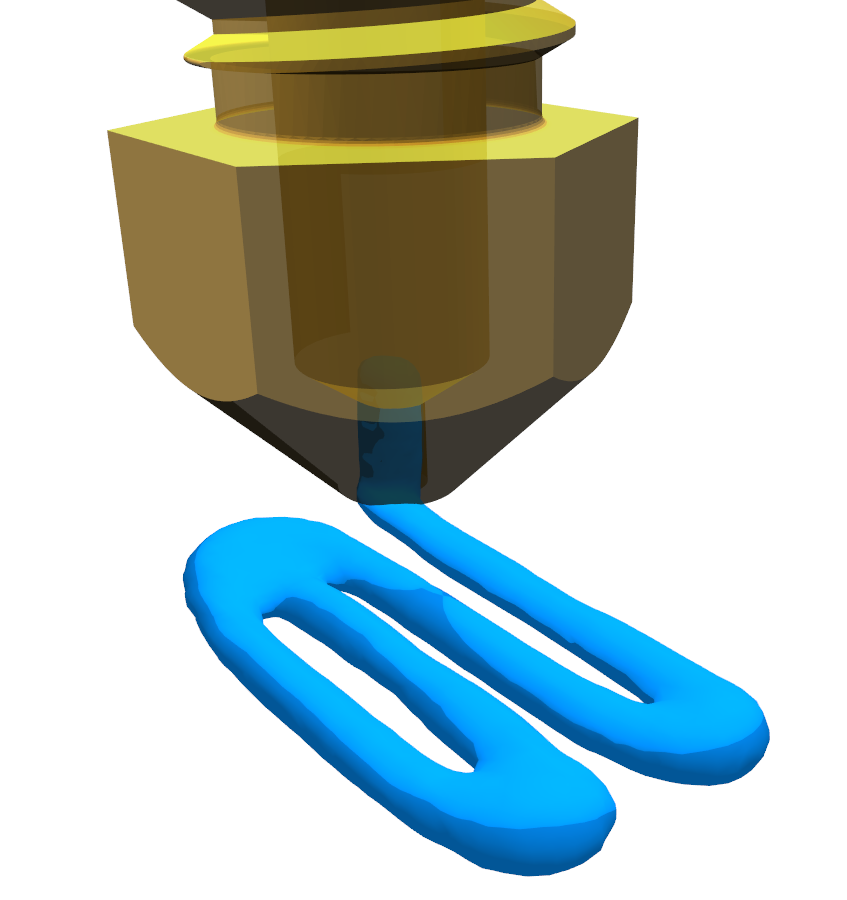

# **Overview**

This repository contains the implementation of a GPU-accelerated **material-extrusion digital twin** used for fast simulation and process control in fused filament fabrication (FFF). The system is built on top of the **Merlin GPU physics and rendering engine**, allowing all simulation, rendering, and data extraction to run entirely on the GPU.



The project demonstrates how particle-based models, heat transfer, and toolpath-driven boundary conditions can be combined into a real-time digital twin. It also includes a Python-based reinforcement learning setup that uses a ZeroMQ interface to communicate with the simulator.
* GPU-accelerated simulation of extrusion, bead formation, and cooling
* Real-time visualization and interactive inspection
* Import of machine G-code and toolpath execution
* A reinforcement learning loop for online flow-rate control
* Example configurations matching those used in the associated research paper

This repository is intended for researchers, developers, and students working on additive manufacturing, digital twins, reinforcement learning, and GPU-based simulation.

---

# **Features**

* **Full GPU physics pipeline**
  SPH-based fluid modeling, PBD constraints, solidification, heat diffusion.

* **High-performance visualization**
  Real-time rendering of particles, isosurfaces (marching cubes), and toolpaths.

* **Toolpath Execution**
  G-code parsing and nozzle motion coupled directly to the simulation.

* **Reinforcement Learning Integration**
  Python RL agent communicates with the C++ simulator via ZeroMQ.

* **Self-contained environment**
  Single Visual Studio solution, no CUDA/OpenCL required.

---

# **Getting Started**

## 1. Clone the repository

This project uses submodules (Merlin engine), so clone with:

```bash
git clone --recurse-submodules <repository-url>
```

If already cloned without submodules:

```bash
git submodule update --init --recursive
```

---

## 2. Generate project files

The repository includes a `premake.lua` file for building the project.

Use **Premake5**:

```bash
premake5 vs2022
```

This will generate a **Visual Studio 2022 solution** with a single main project.

Premake binaries are included in the `extern/` folder, but you may also install Premake system-wide and add it to your PATH.

---

## 3. Build and run

Open the generated `.sln` file in Visual Studio 2022.

Build the project in **Release** or **Debug**, then run the executable.
All shaders, assets, and configuration files are located in the project directory and loaded automatically.

---

# **Repository Structure**

```
/src            # Simulation code (GPU kernels, models, solvers)
/assets         # 3D models, nozzle geometry, sample G-code, Compute and rendering shaders
/extern         # Third-party binaries (Premake, etc.)
/merlin-lib     # Merlin engine library
/py             # Python RL training scripts + ZeroMQ communication backend
```

---

# **Example Usage**

The main application demonstrates:

* Loading a toolpath from G-code
* Simulating extrusion along that path
* Generating bead geometry and thermal fields
* Exporting reconstructed surfaces
* Running RL-based flow-rate control at 25 Hz

You may modify nozzle temperature, flow rates, material properties, or particle counts directly in the configuration files or through the built-in user interface (UI).

---

# **Limitations & Development Status**

This repository is a research prototype.
While the digital twin runs fully on the GPU, several components are still experimental:

* Physical accuracy depends on tuning nonlinear model parameters
* Large particle counts require high-end GPUs
* Real-time hardware coupling is possible but not included in this release

Contributions and bug reports are welcome.

---

# **Contributing**

Contributions are encouraged, especially in:

* Stability and performance improvements
* Additional physics models
* Real-machine integration
* Documentation and examples

Please submit pull requests or open issues for discussion.

---

# **License**

This project is released under **CC BY-NC-SA 3.0**.
Please review the license terms before using or modifying the software.


---

# **Credits**

This project builds on various open-source tools:

* **Merlin Engine** — GPU physics and rendering framework
* **Marching Cubes Implementation** — Michael Walczyk
* **Distance Function Math** — Inigo Quilez
* **Assimp** — 3D model import library
* **ImGui** — Graphical user interface
* **GLFW** — Window and input handling

---

# **Citation**

If you use this project in academic work, please cite the accompanying paper and the Merlin engine:

```bibtex
@software{Merlin_Library,
  author = {Topart, J.},
  license = {CC BY-NC-SA},
  title = {Merlin engine - Library},
  url = {https://github.com/runeworks-engineering/merlin.engine},
}
```
